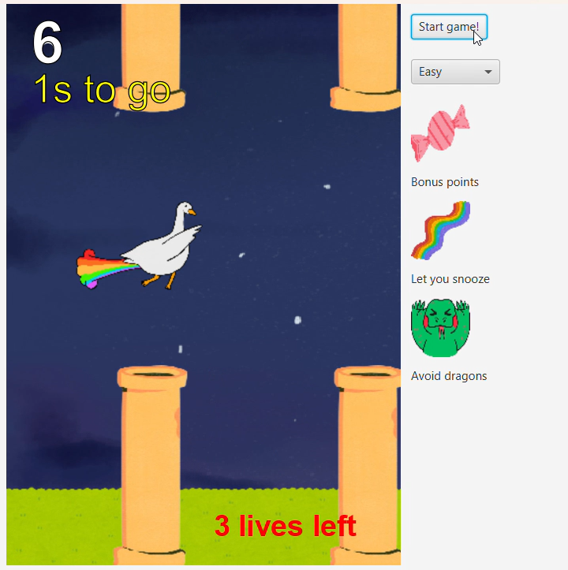
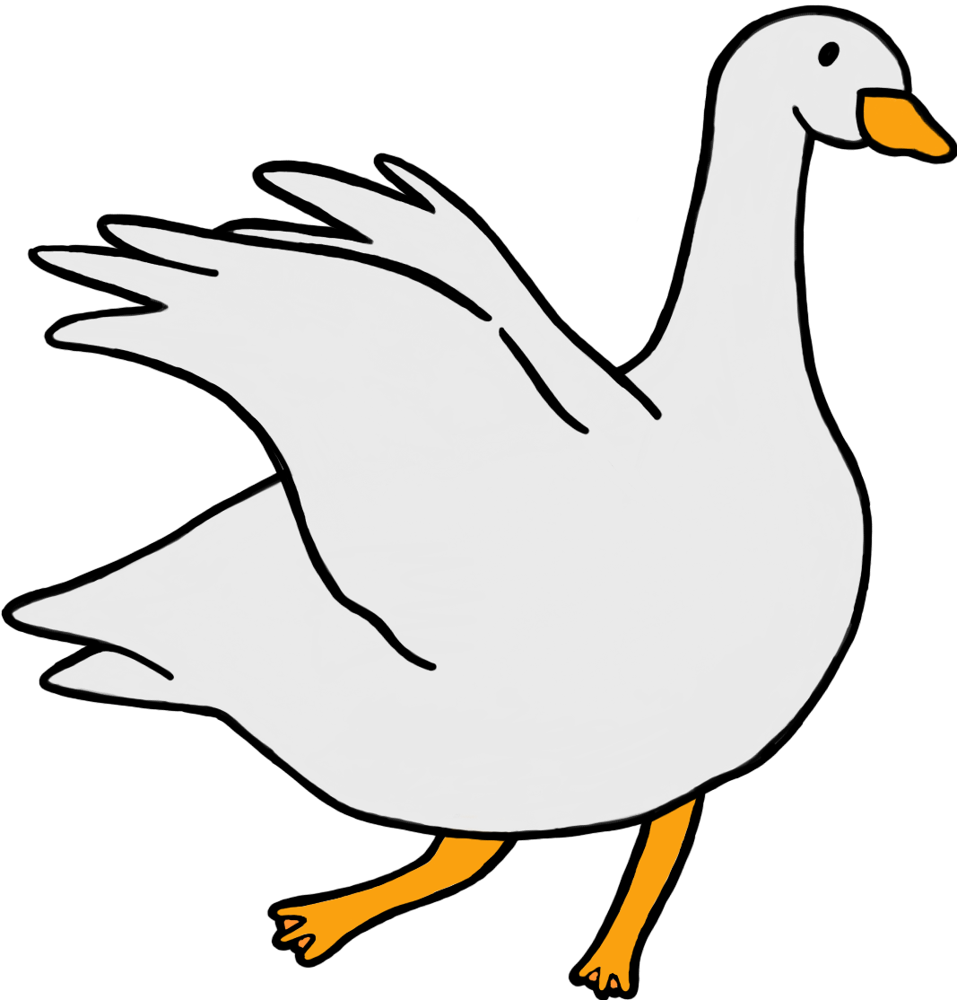
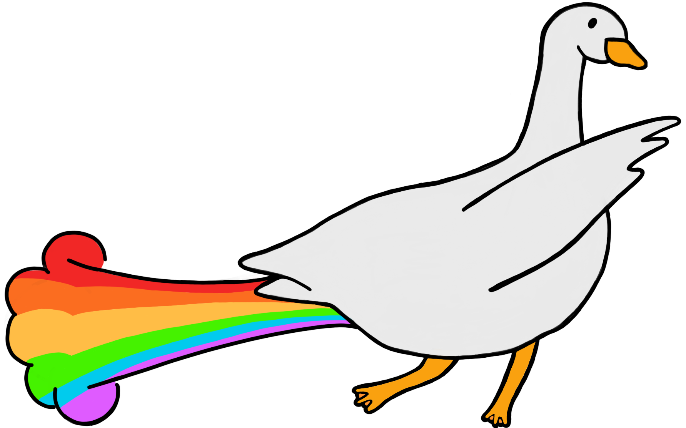
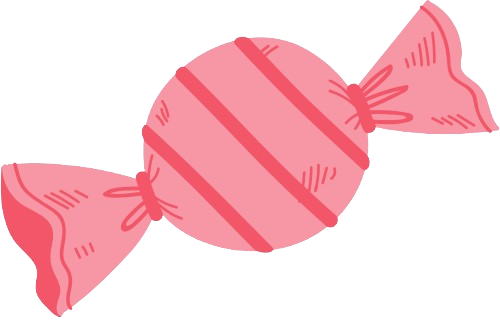
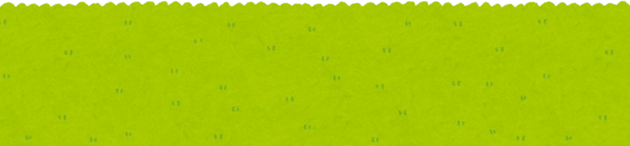

## AngryFlappyJorge Game 

<p align="center">
  A JavaFX application inspired by Jorge and their journey through obstacles :>
</p>
<p align="center">
  Contributors: Linh Ngoc Le, Melita Madhurza
</p>

## Description
This program implements the AngryFlappyJorge game, where a goose named Jorge navigates through obstacles. This game is inspired by the legendary goose, Jorge, adored by Mount Holyoke Community. It creates a joyful experience that connects players to Mount Holyoke's vibrant culture and environment. This game is built with Java and JavaFX. AngryFlappyJorge challenges players to score points, avoid collisions, and collect candies for bonus points.

<p align="center">
  
</p>


## Code Structure
The game consists of several files:

AngryFlappyBird.java: Handles game logic, UI setup, animations, collision detection, and difficulty level implementation.

Defines.java: Contains constants for game elements, initializes images, handles sound effects, and scene settings.

Candy.java, Pipe.java, Dragon.java, Floor.java, Goose.java: Represent different game components, including Jorge (the goose), obstacles, and special objects.

## Components 
| Illustration                        | Name   | Description                                                                 |
|----------------------------------------|------------------|-----------------------------------------------------------------------------|
|   | **Goose - Jorge** | Main character, navigating through obstacles. |
|   | **Goose - Autopilot** | Goose in Autopilot mode. |
|   | **Dragon**      | Dragon as obstacle and candy stealer |
|   | **Normal candy**      | Normal candy, +1 point |
|   | **Rainbow candy**      | Rainbow candy, turn on autopilot mode |
|   | **Floor**      | The lower bound of the game, if collided with Goose, game is over. |
|   | **Day background**      | The day background. |
|   | **Night Background**      | The night background. |
|   | **Pipe**      | Pipe, 2 types: upper pipe and lower pipe as obstacles |

## Features
### Basic features
[x] **Bird**: the Goose avoids all obstacles (including pipes, floors and dragons) while
collecting as many eggs as possible. A player uses the button to control the bird’s flight.
There is a wing flap animation when the bird is flying

[x] **Pipe**: appears in pairs every fixed amount of time. One life is taken from the bird when a collision with any pipe occurs. The bird bounces backward and drops immediately upon
collision.

[x] **Candies**: appear randomly on the upward facing pipes and could be collected either by the Dragon or the Goose. If a Dragon collects a candy, points were lost. If the Goose collects a Candy, different events will be triggered depending on the color of the egg. If a **Normal candy** is collected, points will be added. If a **Rainbow Candy** is collected, 6 seconds of autopilot mode will be triggered.

[x] **Dragon**: drops randomly from downward facing pipes and could collect the egg right beneath it and lead to points lost if the egg is not collected by the Goose first. The game is over and score is reset to 0 if the Goose collides with a Dragon. The Goose bounces backward and drops immediately upon collision.

[x] **Floor**: the floor scrolls through the scene consistently during the game until a collision happens. The game is over and score is reset to 0 if the bird collides with the floor. The bird stops moving immediately upon collision.

[x] **Background**: changes from night to day periodically.

[x] **UI panel**: 
- **Start game**: a button that controls the start of the game and the wing flap of the bird, 
- **Level selector**: a comboBox for user to choose the difficulty levels: Easy, Medium, Hard
- **Introduction box**: icons with respective text description of the normal candy, rainbow candy and the dragon.

[x] **Scores and Lives**: are updated throughout the game.


### Extra features
[x] **Autopilot mode**: the Goose avoids obstacles during the 6 second snooze period.

[x] **Sound effects** for various events including getting through pipes, collecting eggs, and hitting an obstacle.

## Instruction
- Choose the difficulty level: Easy, Medium, or Hard (Easy by default)
- Click the "Start game" button to begin.
- Use mouse clicks "Start game" to control Jorge's movement.
- Avoid collisions with collect candies
- Survive as long as possible and achieve the highest score!

## Requirements
- Java Development Kit (JDK)
- JavaFX SDK

## Getting started 
1. Clone the repo
```
git clone https://github.com/MHC-FA23-CS225/angryflappybird-teamcat
```
2. Import the project to Eclipse
3. Import JavaFX to the project
- Select Build Path
- Select Configure Build Path
- Click on Classpath
- Click on Add Library
- Select User Library
- Check JavaFX[version] and click Finish
- Click Apply and Close
- Run the application
- Right click on the project

4. Select Run As then select Run configurations

5. Open the Arguments tab, and in the VM arguments field, paste the following:
```
--module-path "[path to javafx folder]/lib" --add-modules "javafx.base,javafx.controls,javafx.media"
```
where ```[path to javafx folder]``` is where you store your JavaFx folder

**Note:** Make sure that the box Use the ```-XstartOnFirstThread``` argument when launching with SWT is not checked!

6. Click Run
7. Run the JUnit tests
In the Arguments tab of the test files (stored in the "test" folder), in the VM arguments field, paste the same line as with the main application.

**Note**: Make sure that the JUnit library is imported to the project!


